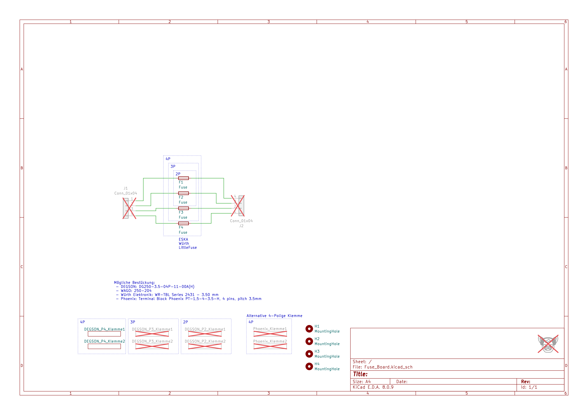
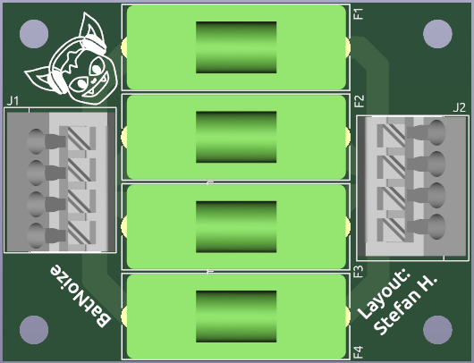
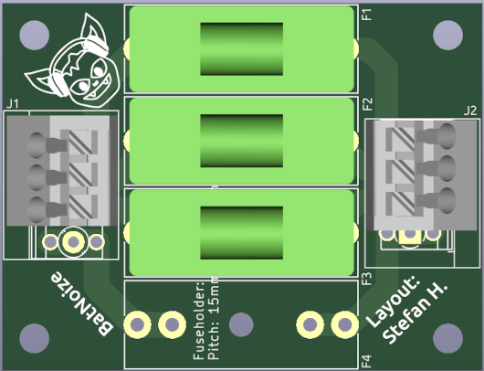

# Fuse Board
Fuse holder for up to 4x "5x20mm" fuses to protect your Eurorack!

This fuse board is designed for up to 4 fuses.

You can attach different types of mounting clamps with a pitch of 3.5 mm.

You can install terminals with a number of terminals from 1 to 4 on both sides.

## Possible Input/Output Connector Clamps
 - DEGSON: DG250-3.5-04P-11-00A(H)
 - WAGO: 250-204
 - Würth Elektronik: WR-TBL Series 2431 - 3.50 mm
 - Phoenix: Terminal Block Phoenix PT-1,5-4-3.5-H, 4 pins, pitch 3.5mm

## Fuse holder
- Fuseholder: 5x20
- Pitch: 15mm OR 22.6mm

## Schematic

## PCB

